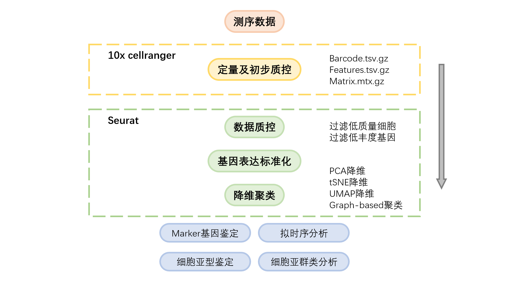

# SingleCell
这是一个单细胞分析流程的笔记
  

首先第一步配置环境以及数据下载方式看[从创建环境到加载数据.md](从创建环境到加载数据.md)  

第二步定量看[cellranger.md](cellranger.md)

第三步用Seurat进行标准分析看[seurat.md](seurat.md)，其中包括Seurat官网教程内容以及使用SingleR进行细胞类型标注

多个样本的分析看[多个样本的分析.md](多个样本的分析.md)，整合分析的方法包括锚点法和harmony法两种

R scripts放在[demo](demo)文件夹中，[demo.R](demo/demo.R)是第三步的代码，[merge.R](demo/merge.R)是第四步整合分析的代码（包括了笔记中略的内容）

数据来源：https://www.nature.com/articles/s41467-020-20059-6#data-availability
