# seurat
## seurat能做什么
 
  

中Seurat能进行分析的部分有“**数据质控**→**基因表达标准化**→降**维聚类**→marker基因鉴定/细胞类型鉴定/细胞亚群分析

### 数据质控
一般微滴里面可能没有细胞，也可能有多个细胞，这部分需要过滤掉

一般凋亡状态或者受到损伤的细胞，线粒体基因的比例会很高，这部分低质量的细胞也需要过滤掉

### 过滤标准

# 代码部分

## 数据读取
Read10X函数读取数据后返回的是UMI count矩阵，接下来用count矩阵创建seurat对象，在这一步就可以做质控，min.cell = n是指一个基因至少在n个细胞里表达，min.features=m是指一个细胞至少表达m个基因。  
（直接读.gz文件）

    library(dplyr)
    library(Seurat)
    library(patchwork)
    # Load the  osteosarcoma tissues dataset 这里我用了一个自己的
    ost.data <- Read10X(data.dir ="SRR11955372/    filtered_feature_bc_matrix")
    # Initialize the Seurat object with the raw     (non-normalized data).
    ost <- CreateSeuratObject(counts = ost.data, project =    "ost", min.cells = 3, min.features = 200)
    ost

## 标准流程

包括QC、数据标准化、确定高变异基因、缩放（归一化）

## QC
细胞低质量的指标

    ost[["percent.mt"]] <- PercentageFeatureSet(ost, pattern = "^MT-")

用来计算每个细胞里某个pattern的基因的比例

    VlnPlot(ost, features = c("nFeature_RNA", "nCount_RNA", "percent.mt"), ncol = 3)

结果如下
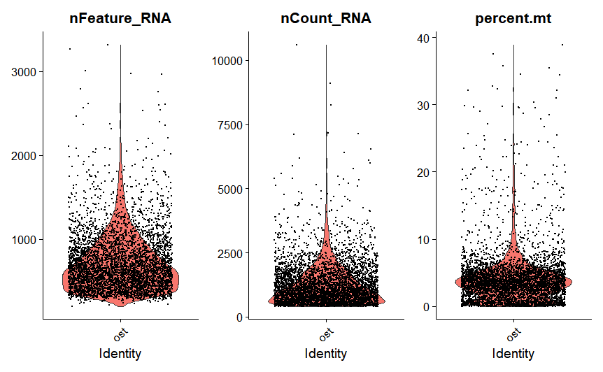  

还可以看不同特征的线性关系

    plot1 <- FeatureScatter(ost, feature1 = "nCount_RNA", feature2 = "percent.mt")
    plot1
 
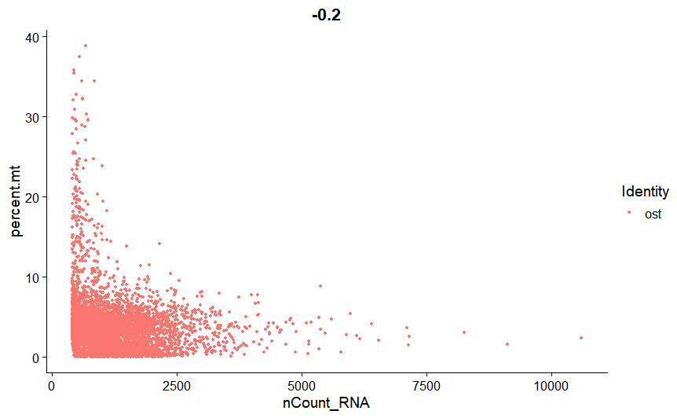  

    plot2 <- FeatureScatter(ost, feature1 = "nCount_RNA", feature2 = "nFeature_RNA")
    plot2

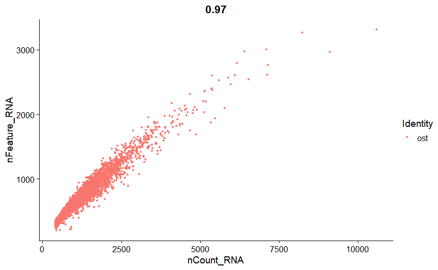  

我们从上图的可视化结果进行细胞选择。我们过滤具有超过2500或少于200个基因计数的细胞，同时过滤掉线粒体比例超过10%的细胞。

    ost <- subset(ost, subset = nFeature_RNA > 200 & nFeature_RNA < 2500 & percent.mt < 10)
同理过滤红细胞

    #计算红细胞比例
    HB.genes = c("HBA1","HBA2","HBB","HBD","HBE1","HBG1","HBG2","HBM","HBQ1", "HBZ")
    HB_m <- match(HB.genes,rownames(scRNA@assays$RNA))
    HB.genes = rownames(scRNA@assays$RNA)[HB_m]
    HB.genes = HB.genes[!is.na(HB.genes)]
    scRNA[["percent.HB"]] <- PercentageFeatureSet(scRNA,features = HB.genes)

    #过滤低质量细胞
    scRNA1 <- subset(scRNA,subset=nFeature_RNA > 200 & nFeature_RNA < 2500 & percent.mt<10 & percent.HB<1)
## 标准化

    ost <- NormalizeData(ost, normalization.method = "LogNormalize", scale.factor = 10000)

## 鉴定高变异基因

鉴定在细胞之间表达水平变异性高的基因，并将这些基因用于下游降维分析。函数默认返回2000个feature，不知道这个参数对下游有什么影响？

    ost <- FindVariableFeatures(ost, selection.method =   "vst", nfeatures = 2000)
    # Identify the 10 most highly variable genes
    top10 <- head(VariableFeatures(ost), 10)

    # plot variable features with and without labels
    plot1 <- VariableFeaturePlot(ost)
    plot2 <- LabelPoints(plot = plot1, points = top10, repel    = TRUE)
    plot2

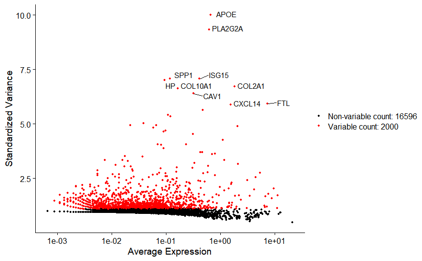  

## 缩放
在PCA降维前对数据做线性转换。ScaleData()有如下作用：  
1.转换每个基因的表达值，使细胞间平均表达值为0。  
2.缩放每个基因的表达值，使细胞间的variance为1，这个步骤让所有基因在下游分析中有相同的权重，避免高变异基因占主导。  
3.结果存储在ost[["RNA"]]@scale.data中。  

>默认的ScaleData函数只使用上一步返回的高变异基因，但是可以自己选择参与ScaleData的基因。DoHeatmap()用的是scale.data，为了不对hetamap造成影响，可以对所有基因都scale。

    all.genes <- rownames(ost)
    ost <- ScaleData(ost, features = all.genes)

在ScaleData()这一步可以消去细胞周期或线粒体污染来源的异质性对细胞分群造成的影响。用vars.to.regress参数，例如ost <- ScaleData(ost, vars.to.regress = "percent.mt")。

    # S3 method for Seurat
    ScaleData(
      object,
      features = NULL,#默认是高变异基因
      assay = NULL,
      vars.to.regress = NULL,#例如uUMI或percent.mito
      split.by = NULL,
      model.use = "linear",
      use.umi = FALSE,
      do.scale = TRUE,
      do.center = TRUE,
      scale.max = 10,
      block.size = 1000,
      min.cells.to.block = 3000,
      verbose = TRUE,
      ...
    )

## 线性降维
默认情况下，只使用前面确定的高变异基因作为input，但是可以使用使用features参数定义自己想用的基因集。

    ost <- RunPCA(ost, features = VariableFeatures(object = ost))

### 维度选择
seurat提供了几个可视化的方法，如VizDimReduction()、DimPlot()和 DimHeatmap()。在这几个可视化中，DimHeatmap()的结果参考价值最大，它允许我们快速查看异质性来源，比如通过每个维度图看细胞类型marker，图中细胞和基因将会被依据PCA分数排序，通过设置cells参数能快速查看表达谱两端的极端细胞。

    VizDimLoadings(ost, dims = 1:2, reduction = "pca")
    DimPlot(ost, reduction = "pca")

函数用法

    DimHeatmap(
      object,
      dims = 1,#用于画图的维度数，一个向量
      nfeatures = 30,
      cells = NULL,#用于画图的细胞数，如果设定数字，显示两端的极值  细胞
      reduction = "pca",
      disp.min = -2.5,
      disp.max = NULL,
      balanced = TRUE,#显示正负极端值的基因
      projected = FALSE,
      ncol = NULL,
      fast = TRUE,
      raster = TRUE,
      slot = "scale.data",
      assays = NULL,
      combine = TRUE
    )

关于维度选择
除了上述的DimHeatmap，还有JackStraw和Elbow方法。对于大型数据，推荐使用速度较快的Eblow

    ElbowPlot(ost)
    #格式 ElbowPlot(object, ndims = 20, reduction = "pca")

 DimHeatmap()单元格和特征都根据它们的PCA分数进行排序。将细胞设置为一个数字可以绘制出光谱两端的“极端”细胞

    DimHeatmap(ost, dims = 1, cells = 500, balanced = TRUE)
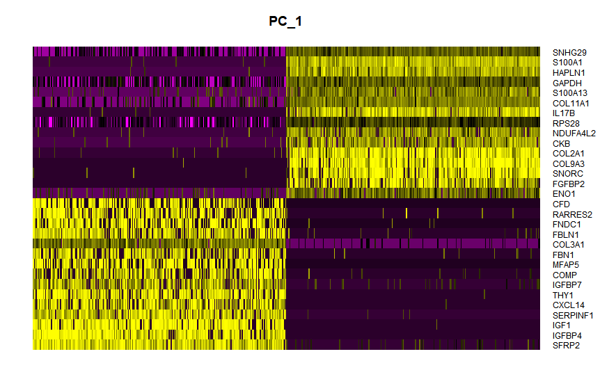  

    DimHeatmap(ost, dims = 1:15, cells = 500, balanced = TRUE)

 研究pc来确定异构性的相关来源。  

JackStraw() 统计PCA评分的统计意义，设置重复取样100次。

ScoreJackStraw()计算Jackstraw的得分差异。

    ost <- JackStraw(ost, num.replicate = 100，dim=50)
    ost <- ScoreJackStraw(ost, dims = 1:50)
#法二--JackStrawPlot()--比较每台PC的p值分布是否均匀(虚线)，基于随机空模型的统计测试，但对于大型数据集来说很耗时，而且可能不会返回一个明确的PC截断值

    JackStrawPlot(ost, dims = 1:40)

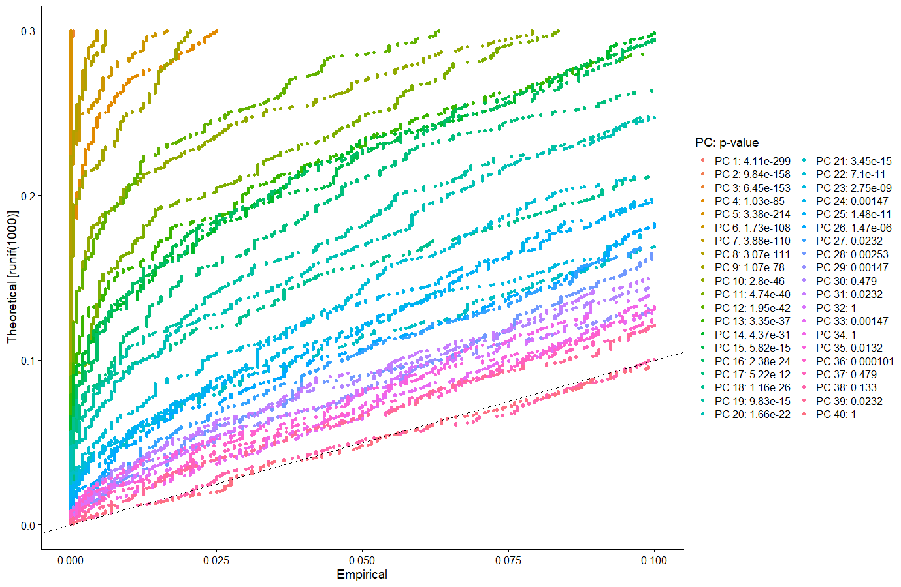  

#法三“肘部图”--ElbowPlot()基于每个成分所解释的方差百分比对主要成分进行排序，属于启发式算法，可以即时计算

    ElbowPlot(ost)

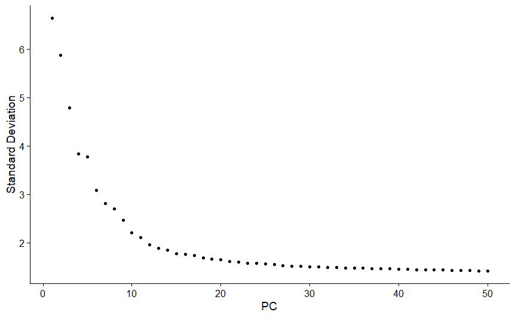  

结合JackStrawPlot的p-value的值（比0.05更显著）和elbowplot的拐点（在拐点之后），进行判断，选择前30个PC进行下游聚类分析

## 细胞聚类
FindNeighbors() 在主成分空间中基于欧氏距离构建KNN图，然后基于相邻区域的共享重叠，定义任意两个单元格之间的边权值。输入值：（pbmc使用的）前10个PCs，这个数字可以自己设定，一般数字大一些，cluster可能会更小一点，试了几个，决定用

    ost <- FindNeighbors(ost, dims = 1:30)
基于共享近邻（SNN）法来识别细胞簇。参数设置在0.4-1.2之间，对3k细胞的数据集有良好的结果，数据集越大，最佳分辨率越高

    ost <- FindClusters(ost, resolution = 0.5) 
 Idents()可查看聚簇结果

    head(Idents(ost), 5)
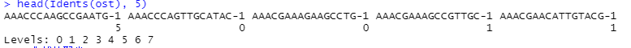  

## 非线性降维

tSNE和UMAP是Seurat进行非线性降维的方法。

    ost <- RunUMAP(ost, dims = 1:30)
    head(ost@reductions$umap@cell.embeddings)  #提取UMAP坐标值
    DimPlot(ost, reduction = "umap")  #降维方法首选umap，再tsne，最后再pca

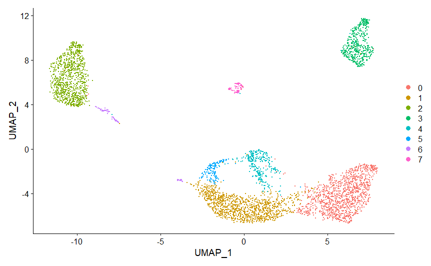  

## 在聚簇中找差异表达的特征
识别单个集群中阳性及阴性的标记

>利用 FindMarkers 命令，可以找到找到各个细胞类型中与其他类别的差异表达基因，作为该细胞类型的生物学标记基因。  
其中ident.1参数设置待分析的细胞类别，min.pct表示该基因表达数目占该类细胞总数的比例

找出簇2中的所有标记物

    cluster2.markers <- FindMarkers(ost, ident.1 = 2, min.pct = 0.25)
    head(cluster2.markers, n = 5)
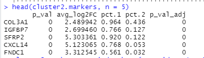  

找出簇5与簇0/3之间的差异表达标志物

    cluster5.markers <- FindMarkers(ost, ident.1 = 5, ident.2 = c(0, 3), min.pct = 0.25)
    head(cluster5.markers, n = 5)
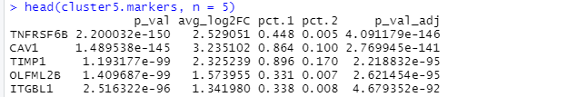  

在所有剩余细胞中找到每簇的标记物，并只报道阳性位点

    ost.markers <- FindAllMarkers(ost, only.pos = TRUE, min.pct = 0.25, logfc.threshold = 0.25)
    ost.markers %>%
        group_by(cluster) %>%
        slice_max(n = 2, order_by = avg_log2FC)
#这里的管道函数%>%需要调用dplyr包，将左边的数据导入右边，按照cluster进行排序，并返回avg_log2FC中变量最高的2列  
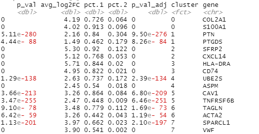  

ROC测试返回任何单个标记的“分类能力”(范围从0 -随机，到1 -完美)。

    cluster0.markers <- FindMarkers(ost, ident.1 = 0, logfc.threshold = 0.25, test.use = "roc", only.pos = TRUE)
VlnPlot()和FeaturePlot()用来可视化tSNE和PCA的位点
    
    #选择前面findmarker找到的特异性表达基因
    #例如我这里选择的是
    VlnPlot(ost, features = c("COL2A1", "S100A1"))
 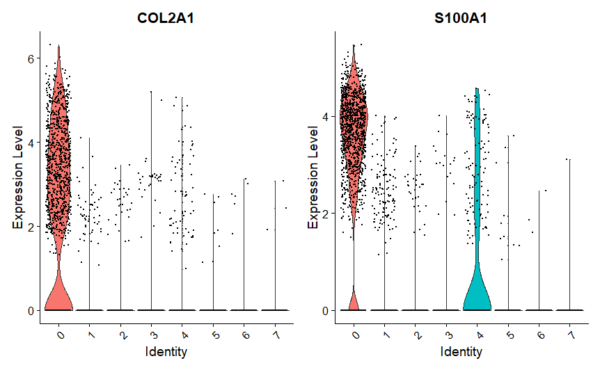  

    VlnPlot(ost, features = c("CXCL14", "SFRP2"), slot = "counts", log = TRUE)
 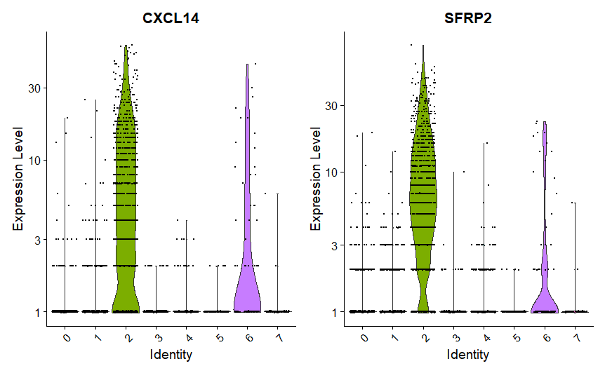  

    FeaturePlot(ost, features = c("PTN", "SLAMF9", "COMP", "HLA-DRA", "IFITM5", "COL2A1", "ASPM", "PLA2G2A", "CAV1"))

 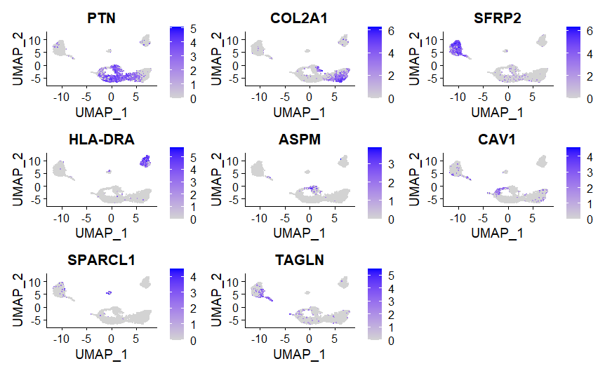  

## 给cluster 分配细胞类型标识 
不同于pbmc有现成的标识，其他的细胞就需要自己去查，还可以借助R包singleR和celldex进行标识（参考HumanPrimaryCellAtlasData）

    library(celldex)
    hpca.ref <- HumanPrimaryCellAtlasData()
    pred <- SingleR(test = ost@assays$RNA@data, ref = hpca. ref, labels = hpca.ref$label.main,  clusters = ost@active.   ident)

    table(pred$labels)
    pdf("cell_type.pdf")
    plotScoreHeatmap(pred)
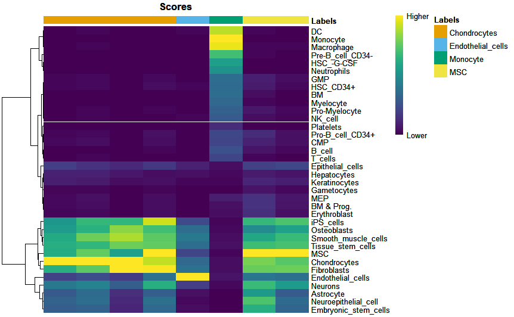  

    plotDeltaDistribution(pred, ncol = 3)
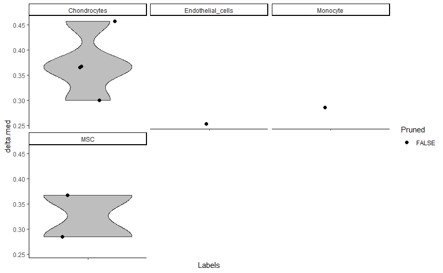  

    new.cluster.ids <- pred$labels
    names(new.cluster.ids) <- levels(ost)
    ost <- RenameIdents(ost, new.cluster.ids)
    DimPlot(ost, reduction = "umap", label = TRUE, pt.size =    0.5) + NoLegend()

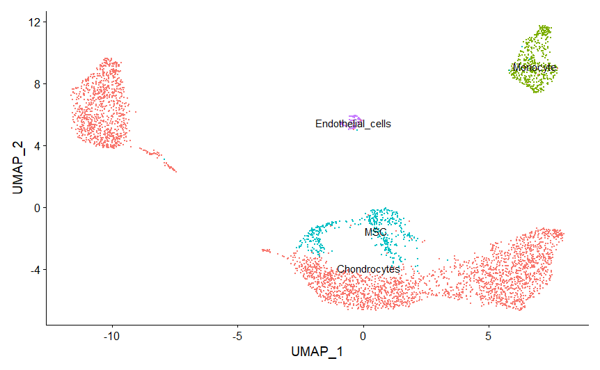  

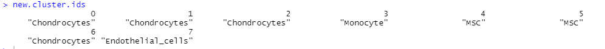  

如图，说明cluster0，1，2属于一类，4,5也属于一类，clusters分多了，所以dim的值可能需要更大一些。

>singleR可以同时使用多个数据库注释  
还有用机器学习的方法注释，感兴趣的可以查
