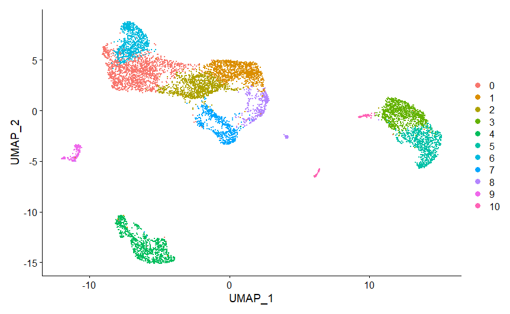
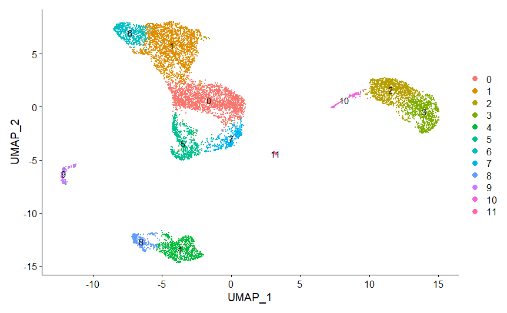

# 多个样本的整合分析

之前介绍了单个样本的分析方法，实际过程中往往会有多个样品，这就需要在单个样品的细胞质控完成后，进行样品数据整合分析。

## 读取数据
    dir0 <- list.files('./',pattern='SRR')
    scRNA.list <- list()
    dir <-list()
    for(i in 1:length(dir0)){
        dir[[i]]<-list.dirs(paste('./',dir0[i],'/', sep = ""))
        counts=Read10X(data.dir = dir[[i]][-1])
        scRNA.list[[i]]<- CreateSeuratObject(counts,project=dir0[i],min。cells = 3,min.features = 200)
    }
 

## 批次效应矫正
### 锚点法
Seurat提供了一组Integration方法来去除批次效应，这些方法首先识别处于匹配生物学状态（anchors）的跨数据集细胞对，然后基于这些anchors校正数据集之间的批次效应

>锚点法整合速度很慢，且常常过度整合，因此实际操作中跨物种整合或不同的数据类型如ATAC、蛋白组数据与单细胞数据整合时可用锚点整合，单纯的单细胞数据整合用harmony法

首先提取用来进行Integration的基因，然后找到anchors，基于anchors进行批次效应矫正

    #锚点法
    for(i in 1:length(dir)){
        scRNA.list[[i]]<- RenameCells(scRNA.list[[i]],add.cell.id = dir0[i])
        scRNA.list[[i]][["percent.mt"]] <- PercentageFeatureSet(scRNA.list[[i]], pattern = "^MT-")
        scRNA.list[[i]] <- subset(scRNA.list[[i]], subset = nFeature_RNA > 200 & nFeature_RNA < 2500 & percent.mt < 10)
        scRNA.list[[i]]<- NormalizeData(scRNA.list[[i]])
        scRNA.list[[i]]<- FindVariableFeatures(scRNA.list[[i]],selection.method='vst')
    }

    #找到不同细胞共有的高变基因
    features <- SelectIntegrationFeatures(object.list=scRNA.list)
    #找到锚定点
    scRNA.anchors <- FindIntegrationAnchors(object.list=scRNA.list,anchor.  features=features)
    #进行数据整合
    scRNA1 <- IntegrateData(anchorset = scRNA.anchors)
    #接下来进行ScaleData、PCA、TSNE、UMAP等处理（略）
  

### harmony法

与锚点整合法不同，锚点整合法在对数据进行归一化处理时，需要将不同样本的数据分开处理，但harmony法不需要拆分样本（harmony算法不建议与SCTransform一起使用）

 第一步 读取数据并创建Seurat对象

    #上接读取数据步骤
    scRNA_harmony <- merge(scRNA.list[[1]], y = scRNA.list[2:length(scRNA.list)])

第二步 对Seurat对象进行归一化处理与PCA降维  

harmony是根据PCA的数据进行整合，因此在整合前必须要对数据进行归一化处理与PCA降维

    scRNA_harmony <- NormalizeData(scRNA_harmony) %>% FindVariableFeatures() %>% ScaleData() %>% RunPCA(verbose=FALSE)

第三步 进行harmony整合

    #group.by.vars指定分组依据
    scRNA_harmony <- RunHarmony(scRNA_harmony,group.by.vars = "orig.ident")

第四步 按照正常流程进行umap降维、tsne降维与可视化与后续步骤

    #需指定reduction参数为harmony
    scRNA_harmony <- RunUMAP(scRNA_harmony,reduction =    "harmony",dims=1:30)
    scRNA_harmony <- FindNeighbors(scRNA_harmony,reduction =    "harmony",dims=1:30) %>% FindClusters(resolution = 0.5)

    plot1=DimPlot(scRNA_harmony,reduction = "umap",label=T)
    plot1
  

## 差异分析
看需求，进行分析